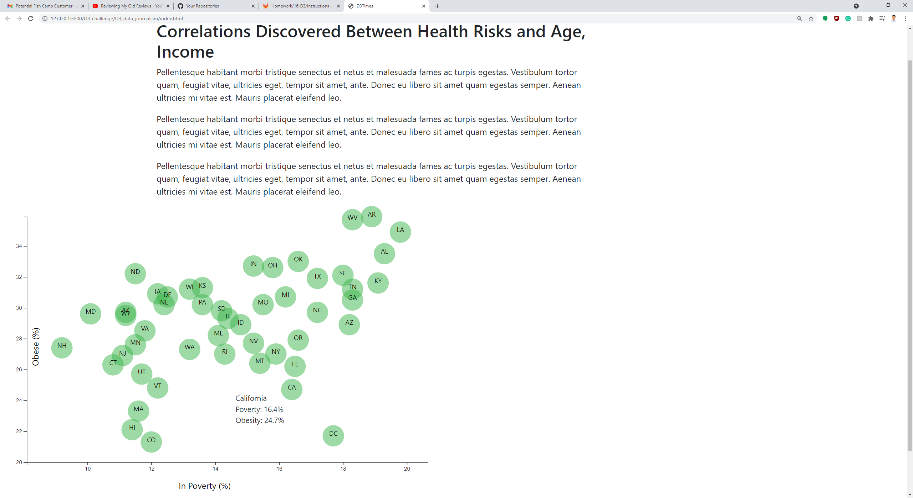

# D3-challenge

This challenges uses [census data](assets/data/data.csv) to graph out the correlation between obesity and poverty. The States census data is read through as numerics to prepare for the graph. Each state is represented by its own bubble filled in by the State names. The x and y scale is determined by the maximum values for poverty and obesity rate. A tool tip appear when the user hovers over state bubble with the respective state's poverty and obesity rate.

